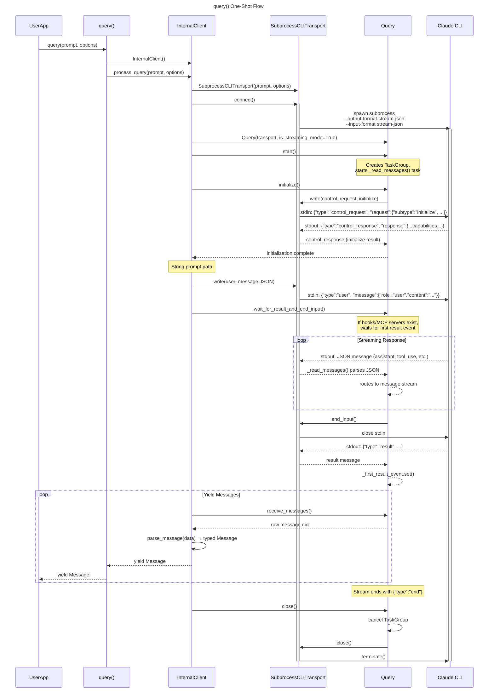
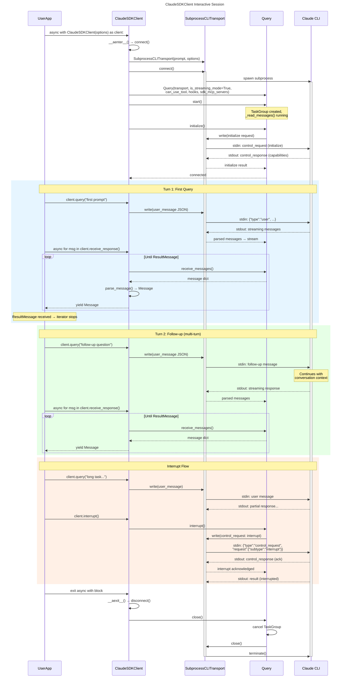
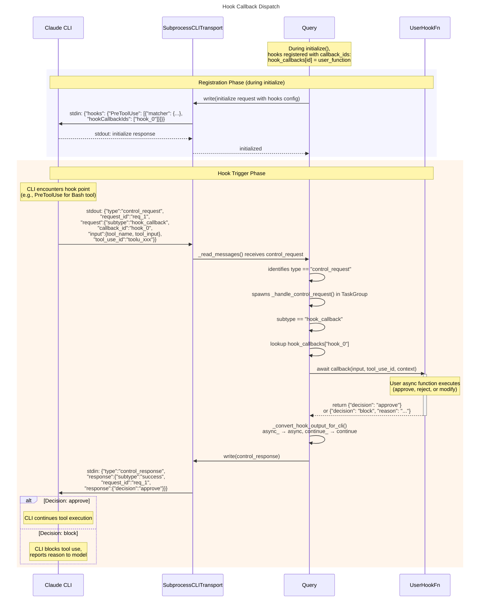
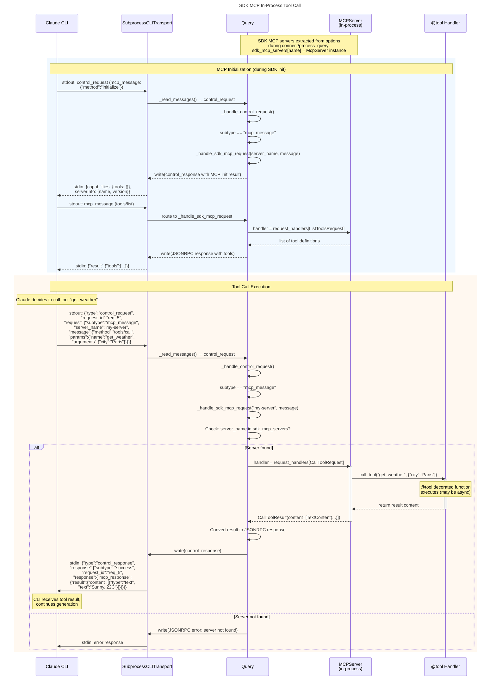

# Sơ đồ tuần tự — Claude Agent SDK Python

| # | Sơ đồ | Mô tả | Participants |
|---|---------|-------------|--------------|
| 1 | Luồng query() một lần | Vòng đời đầy đủ của truy vấn stateless một lần | UserApp, query(), InternalClient, Transport, Query, CLI |
| 2 | Phiên tương tác ClaudeSDKClient | Hội thoại hai chiều đa lượt kèm interrupt | UserApp, ClaudeSDKClient, Transport, Query, CLI |
| 3 | Dispatch Hook Callback | Hook callback do CLI khởi tạo, định tuyến đến Python handler | CLI, Transport, Query, UserHookFn |
| 4 | Gọi MCP Tool SDK In-Process | Thực thi MCP tool in-process qua decorator @tool | CLI, Transport, Query, MCPServer, ToolHandler |

---

## 1. Luồng query() một lần

Hiện toàn bộ vòng đời khi user gọi `query(prompt="...", options=...)`. SDK tạo `InternalClient`, thiết lập transport và `Query`, thực hiện bắt tay initialize, gửi prompt, stream phản hồi, và dọn dẹp toàn bộ.

**Điểm quan trọng từ mã nguồn:**
- `query()` trong [`query.py:11`](../../src/claude_agent_sdk/_internal/query.py#L11) tạo `InternalClient` và uỷ quyền cho `process_query()`
- `InternalClient.process_query()` trong [`client.py:44`](../../src/claude_agent_sdk/_internal/client.py#L44) điều phối toàn bộ vòng đời
- Transport luôn dùng `--input-format stream-json` (dòng 331 trong subprocess_cli.py)
- Với string prompt, user message được ghi vào stdin sau initialize (client.py:126-133)
- `wait_for_result_and_end_input()` giữ stdin mở nếu hooks/MCP servers cần giao tiếp hai chiều

---

## 2. Phiên tương tác ClaudeSDKClient

Hiện một phiên hội thoại đa lượt dùng `ClaudeSDKClient` như async context manager, bao gồm message tiếp nối và khả năng interrupt.

**Điểm quan trọng từ mã nguồn:**
- `ClaudeSDKClient.__aenter__()` gọi `connect()` không có prompt → dùng async generator rỗng (client.py:102-107)
- `client.query()` trong [`client.py:197`](../../src/claude_agent_sdk/_internal/client.py#L197) ghi user messages trực tiếp vào transport qua JSON
- `receive_response()` trong [`client.py:442`](../../src/claude_agent_sdk/_internal/client.py#L442) bọc `receive_messages()` và dừng sau `ResultMessage`
- `interrupt()` gửi control request với `subtype: "interrupt"` (query.py:536-538)
- `__aexit__()` luôn gọi `disconnect()` → `query.close()` → `transport.close()`

---

## 3. Dispatch Hook Callback

Hiện cách CLI khởi tạo hook callback (VD: PreToolUse) và cách lớp `Query` của SDK dispatch nó đến hàm async Python do user định nghĩa. Đây là luồng phức tạp nhất vì CLI là bên khởi tạo.

**Điểm quan trọng từ mã nguồn:**
- Đăng ký hook xảy ra trong `Query.initialize()` (query.py:119-163): mỗi hook nhận `callback_id` duy nhất ánh xạ đến hàm Python
- CLI gửi hook callbacks dạng `control_request` với `subtype: "hook_callback"` (query.py:288)
- `_handle_control_request()` tại query.py:236 dispatch dựa trên subtype
- Tên trường Python `async_` và `continue_` được chuyển thành `async`/`continue` cho wire format bởi `_convert_hook_output_for_cli()` (query.py:34-50)
- Khớp response dùng `request_id` để tương quan requests và responses

---

## 4. Gọi MCP Tool SDK In-Process

Hiện cách SDK MCP servers (định nghĩa qua decorator `@tool` và `create_sdk_mcp_server()`) xử lý gọi tool hoàn toàn in-process. Khác với MCP server bên ngoài chạy như subprocess, SDK MCP tools thực thi ngay trong tiến trình Python.

**Điểm quan trọng từ mã nguồn:**
- SDK MCP servers được trích xuất từ `options.mcp_servers` nơi `type == "sdk"` (client.py:143-147)
- `_handle_sdk_mcp_request()` tại query.py:394 định tuyến JSONRPC methods thủ công vì Python MCP SDK thiếu Transport abstraction
- Methods được hỗ trợ: `initialize`, `tools/list`, `tools/call`, `notifications/initialized` (query.py:431-514)
- Gọi tool đi qua `server.request_handlers[CallToolRequest]` để gọi handler được trang trí `@tool`
- Trường `instance` bị loại bỏ khỏi SDK server config trước khi truyền cho CLI (subprocess_cli.py:246-250)
- Tất cả giao tiếp đều in-process — không có subprocess IPC cho SDK MCP tools
