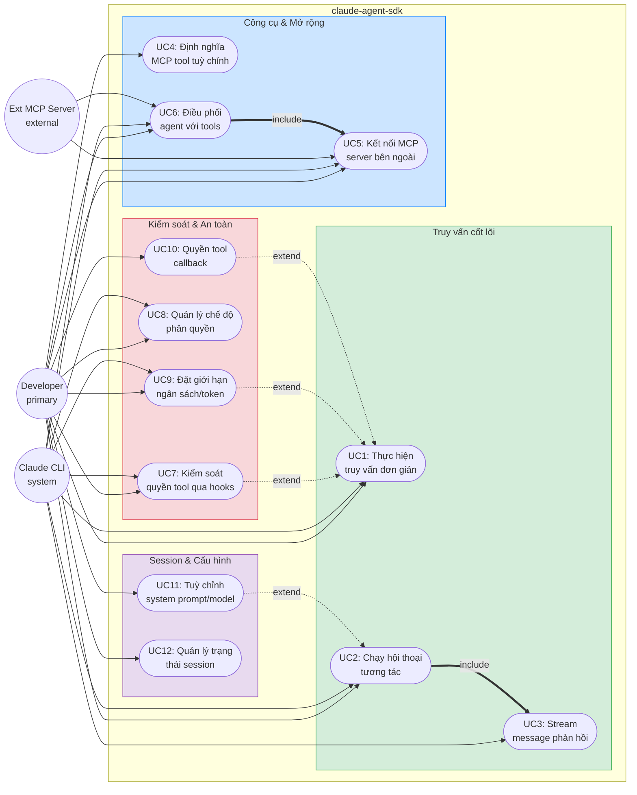

# Use Case Diagram — Claude Agent SDK Python

> Dùng Mermaid flowchart thay vì UML use case diagram vì Mermaid chưa hỗ trợ cú pháp use case native. Tuân thủ ngữ nghĩa UML: actor tròn, ca sử dụng bầu dục, ranh giới hệ thống (subgraph).

## Chú giải

| Ký hiệu | Ý nghĩa |
|--------|---------|
| `((Tên))` | Actor (UML stick figure) |
| `([Tên])` | Ca sử dụng (Use Case - hình bầu dục) |
| `───▶` | Association (actor tham gia ca sử dụng) |
| `═══▶` | `<<include>>` (bắt buộc kèm theo) |
| `╌╌▶` | `<<extend>>` (mở rộng tuỳ chọn) |
| `subgraph` | Ranh giới hệ thống con |

**Phân loại Actor:**
- **Developer** `<<primary>>` — Con người viết code Python dùng SDK
- **Claude Code CLI** `<<system>>` — Subprocess mà SDK bọc lại
- **External MCP Server** `<<external>>` — MCP server bên thứ ba kết nối qua subprocess

---

## Sơ đồ Use Case

---

## Mô tả ca sử dụng

| ID | Ca sử dụng | Mô tả | Điểm vào SDK | Ví dụ |
|----|----------|-------------|----------|---------|
| UC1 | Thực hiện truy vấn đơn giản | Gửi prompt, nhận phản hồi hoàn chỉnh | `query()` | `quick_start.py` |
| UC2 | Chạy hội thoại tương tác | Hội thoại đa lượt với tiếp nối | `ClaudeSDKClient` | session có trạng thái |
| UC3 | Stream message phản hồi | Nhận messages khi được sinh (thời gian thực) | Cả hai | `streaming_mode.py` |
| UC4 | Định nghĩa MCP tool tuỳ chỉnh | Tạo tool in-process bằng decorator `@tool` | Cả hai | `mcp_calculator.py` |
| UC5 | Kết nối MCP server bên ngoài | Thêm MCP server bên thứ ba (stdio/sse/http) | Cả hai | Cấu hình server |
| UC6 | Điều phối agent với tools | Quản lý agent definitions và subagent tools | `ClaudeSDKClient` | `agents.py` |
| UC7 | Kiểm soát quyền tool qua hooks | Callback PreToolUse/PostToolUse cho phép/từ chối | Cả hai | `hooks.py` |
| UC8 | Quản lý chế độ phân quyền | Đặt allowedTools, chế độ phân quyền | `ClaudeSDKClient` | `tools_option.py` |
| UC9 | Đặt giới hạn ngân sách/token | Kiểm soát chi phí qua maxBudgetUsd | Cả hai | `max_budget_usd.py` |
| UC10 | Quyền tool callback | Callback can_use_tool cho quyền tool chi tiết | Cả hai | `tool_permission_callback.py` |
| UC11 | Tuỳ chỉnh system prompt/model | Đặt system prompt và tham số model | Cả hai | `system_prompt.py` |
| UC12 | Quản lý trạng thái session | Quản lý trạng thái hội thoại, interrupt, ngắt kết nối | `ClaudeSDKClient` | Phiên đa lượt |

---

## Ghi chú phân loại Actor

### Tại sao Hook System KHÔNG phải actor
Trong UML use case diagram, **actor** là thực thể bên ngoài ranh giới hệ thống tương tác với nó. Hook System nằm bên trong SDK — nó là cơ chế/hệ thống con nội bộ, không phải actor. Hooks được:
- **Định nghĩa** bởi Developer (người viết callback functions)
- **Kích hoạt** bởi CLI (gửi hook callback requests)
- **Thực thi** bởi Query (dispatch đến hàm Python)

### Ranh giới hệ thống
Ranh giới hệ thống bao gồm toàn bộ `claude-agent-sdk` package. CLI và MCP server bên ngoài nằm NGOÀI ranh giới vì chúng là tiến trình riêng biệt mà SDK tương tác thông qua giao thức (subprocess stdin/stdout và MCP protocol).
