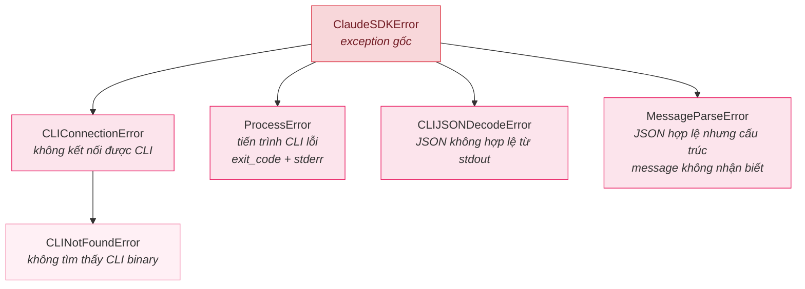

# Claude Agent SDK — Sơ đồ kiến trúc

> Phiên bản SDK: 0.1.48 | Ngày: 2026-03-22 | 15 file mã nguồn

## Chú giải

| Màu | Tầng | Mô tả |
|-------|-------|-------------|
| Xanh lá | API công khai | Điểm vào và decorator hướng user |
| Xanh dương | Xử lý nội bộ | Giao thức điều khiển, phân tích message, quản lý session |
| Cam | Transport | I/O subprocess, phát hiện CLI binary, JSON streaming |
| Xám | Bên ngoài | Tiến trình Claude CLI, MCP server bên ngoài |
| Hồng | Xuyên suốt | Types, errors, thông tin phiên bản |

**Kiểu mũi tên:**
- `──▶` Liền: luồng dữ liệu (requests/responses)
- `╌╌▶` Nét đứt: phụ thuộc cấu hình hoặc kiểu
- Nhãn mô tả dữ liệu chảy dọc mũi tên

---

## 1. Sơ đồ kiến trúc chính

SDK có hai điểm vào (`query()` cho một lần, `ClaudeSDKClient` cho tương tác) hội tụ tại `Query` - bộ xử lý giao thức điều khiển. Query quản lý toàn bộ giao tiếp hai chiều với subprocess Claude CLI thông qua `SubprocessCLITransport`.

```mermaid
graph TD
    subgraph PUB["Public API Layer"]
        QF["query&#40;&#41;<br/><i>query.py</i>"]
        CSC["ClaudeSDKClient<br/><i>client.py</i>"]
        TOOL["@tool decorator<br/><i>__init__.py</i>"]
        CMCP["create_sdk_mcp_server&#40;&#41;<br/><i>__init__.py</i>"]
    end

    subgraph INT["Internal Processing Layer"]
        IC["InternalClient<br/><i>_internal/client.py</i>"]
        Q["Query<br/><i>_internal/query.py</i>"]
        MP["MessageParser<br/><i>message_parser.py</i>"]
    end

    subgraph TRA["Transport Layer"]
        SCT["SubprocessCLITransport<br/><i>subprocess_cli.py</i>"]
    end

    subgraph EXT["External"]
        CLI["Claude Code CLI<br/><i>subprocess</i>"]
        EMCP["External MCP Servers<br/><i>separate processes</i>"]
    end

    subgraph CRS["Cross-cutting"]
        TYPES["types.py<br/><i>Message, Options, Hooks</i>"]
        ERRS["_errors.py<br/><i>ClaudeSDKError hierarchy</i>"]
        SESS["sessions.py<br/><i>historical session reader</i>"]
    end

    %% query() path
    QF -->|"prompt + options"| IC
    IC -->|"process_query&#40;&#41;"| Q

    %% ClaudeSDKClient path
    CSC -->|"connect / query / interrupt"| Q

    %% MCP tool registration
    TOOL -->|"defines tools"| CMCP
    CMCP -->|"McpServer instance"| Q

    %% Internal processing
    Q -->|"control requests<br/>via stdin JSON"| SCT
    SCT -->|"stdout JSON messages"| Q
    Q -->|"raw message dicts"| MP
    MP -->|"typed Message objects"| QF
    MP -->|"typed Message objects"| CSC

    %% Transport to CLI
    SCT -->|"stdin: stream-json"| CLI
    CLI -->|"stdout: JSON messages"| SCT
    CLI -.->|"MCP protocol"| EMCP

    %% Cross-cutting dependencies
    TYPES -.->|"used by all layers"| PUB
    TYPES -.->|"used by all layers"| INT
    ERRS -.->|"raised by"| TRA

    %% Styles
    classDef public fill:#d4edda,stroke:#28a745,color:#155724
    classDef internal fill:#cce5ff,stroke:#007bff,color:#004085
    classDef transport fill:#fff3cd,stroke:#ffc107,color:#856404
    classDef external fill:#e2e3e5,stroke:#6c757d,color:#383d41
    classDef crosscut fill:#f8d7da,stroke:#dc3545,color:#721c24

    class QF,CSC,TOOL,CMCP public
    class IC,Q,MP internal
    class SCT transport
    class CLI,EMCP external
    class TYPES,ERRS,SESS crosscut
```

**Cách đọc:** Trên = code ứng dụng user, dưới = subprocess CLI. Dữ liệu chảy xuống (requests) và lên (responses). Hai điểm vào (trái: `query()`, phải: `ClaudeSDKClient`) hội tụ tại `Query`, đây là trung tâm điều phối quản lý toàn bộ giao tiếp với CLI.

---

## 2. Chi tiết: Định tuyến message giao thức điều khiển

Bên trong `Query._read_messages()`, JSON đến từ CLI được định tuyến đến ba handler khác nhau dựa trên trường `type`.

```mermaid
graph TD
    subgraph INPUT["CLI stdout"]
        MSG["JSON message from CLI"]
    end

    subgraph ROUTER["Query._read_messages&#40;&#41;"]
        CHECK{"message.type?"}
    end

    subgraph HANDLERS["Handlers"]
        CR["control_response<br/>Match request_id → wake Event"]
        CQ["control_request<br/>Spawn _handle_control_request&#40;&#41;"]
        MS["Regular message<br/>Send to message stream"]
    end

    subgraph SUBTYPES["control_request subtypes"]
        HOOK["hook_callback<br/>Dispatch to user hook fn"]
        PERM["can_use_tool<br/>Dispatch to permission callback"]
        MCP["mcp_message<br/>Route to SDK MCP server"]
    end

    subgraph OUTPUT["Consumers"]
        PENDING["pending_control_responses<br/>dict&#91;request_id, Event&#93;"]
        STREAM["_message_receive<br/>anyio memory stream"]
    end

    MSG --> CHECK
    CHECK -->|"control_response"| CR
    CHECK -->|"control_request"| CQ
    CHECK -->|"other"| MS

    CR --> PENDING
    MS --> STREAM

    CQ --> HOOK
    CQ --> PERM
    CQ --> MCP

    classDef router fill:#e8f4fd,stroke:#2196F3
    classDef handler fill:#fff3e0,stroke:#ff9800
    classDef output fill:#e8f5e9,stroke:#4caf50

    class CHECK router
    class CR,CQ,MS,HOOK,PERM,MCP handler
    class PENDING,STREAM output
```

---

## 3. Chi tiết: Kiến trúc hệ thống Hook

Hiện cách hooks được đăng ký trong `initialize()` và được dispatch khi CLI kích hoạt chúng.

```mermaid
graph TD
    subgraph REG["Registration &#40;during initialize&#41;"]
        HM["HookMatcher<br/>matcher pattern + hooks list"]
        CB["User async callbacks"]
        MAP["hook_callbacks dict<br/>callback_id → function"]
        INIT["Initialize request<br/>hooks config with callback_ids"]
    end

    subgraph TRIGGER["Trigger &#40;runtime&#41;"]
        CLIP["CLI encounters hook point"]
        REQ["control_request<br/>subtype: hook_callback<br/>callback_id + input + tool_use_id"]
    end

    subgraph DISPATCH["Dispatch &#40;Query&#41;"]
        LOOKUP["Lookup hook_callbacks&#91;callback_id&#93;"]
        CALL["await callback&#40;input, tool_use_id, ctx&#41;"]
        CONVERT["_convert_hook_output_for_cli&#40;&#41;<br/>async_ → async<br/>continue_ → continue"]
    end

    subgraph RESPONSE["Response"]
        RESP["control_response<br/>request_id match"]
        DECIDE{"CLI decision"}
        APPROVE["Continue execution"]
        BLOCK["Block tool use"]
    end

    HM -->|"extract hooks"| CB
    CB -->|"register with id"| MAP
    MAP -->|"callback_ids"| INIT
    INIT -->|"stdin to CLI"| CLIP

    CLIP -->|"stdout"| REQ
    REQ --> LOOKUP
    LOOKUP --> CALL
    CALL --> CONVERT
    CONVERT --> RESP
    RESP --> DECIDE
    DECIDE -->|"approve"| APPROVE
    DECIDE -->|"deny"| BLOCK

    classDef reg fill:#e3f2fd,stroke:#1565c0
    classDef trigger fill:#fce4ec,stroke:#c62828
    classDef dispatch fill:#f3e5f5,stroke:#7b1fa2
    classDef resp fill:#e8f5e9,stroke:#2e7d32

    class HM,CB,MAP,INIT reg
    class CLIP,REQ trigger
    class LOOKUP,CALL,CONVERT dispatch
    class RESP,DECIDE,APPROVE,BLOCK resp
```

**Sự kiện hook:** PreToolUse, PostToolUse, PostToolUseFailure, UserPromptSubmit, Stop, SubagentStart, SubagentStop, PreCompact, Notification, PermissionRequest

---

## 4. Chi tiết: SDK MCP vs External MCP

Hiện sự khác biệt kiến trúc then chốt: SDK MCP tools thực thi in-process, trong khi MCP server bên ngoài chạy như subprocess riêng do CLI quản lý.

```mermaid
graph LR
    subgraph SDK_PATH["SDK MCP &#40;in-process&#41;"]
        TOOL2["@tool decorator"]
        FACTORY["create_sdk_mcp_server&#40;&#41;"]
        SERVER["McpServer instance<br/>in Python process"]
        HANDLER["@tool handler function"]
    end

    subgraph EXT_PATH["External MCP &#40;subprocess&#41;"]
        CONFIG["MCP config<br/>stdio/sse/http"]
        PROC["Separate process<br/>managed by CLI"]
        EXTOOL["External tool handlers"]
    end

    subgraph QUERY["Query &#40;routing&#41;"]
        Q2["_handle_sdk_mcp_request&#40;&#41;"]
    end

    subgraph CLI2["Claude CLI"]
        DECIDE2{"Tool is SDK<br/>or External?"}
    end

    TOOL2 --> FACTORY
    FACTORY --> SERVER

    DECIDE2 -->|"SDK: control_request<br/>subtype: mcp_message"| Q2
    Q2 -->|"CallToolRequest"| SERVER
    SERVER --> HANDLER
    HANDLER -->|"result"| Q2
    Q2 -->|"control_response"| DECIDE2

    DECIDE2 -->|"External: direct<br/>MCP protocol"| PROC
    CONFIG --> PROC
    PROC --> EXTOOL
    EXTOOL -->|"result"| PROC
    PROC -->|"result"| DECIDE2

    classDef sdk fill:#e8f5e9,stroke:#2e7d32
    classDef ext fill:#e2e3e5,stroke:#757575
    classDef query fill:#e3f2fd,stroke:#1565c0
    classDef cli fill:#fff3e0,stroke:#ef6c00

    class TOOL2,FACTORY,SERVER,HANDLER sdk
    class CONFIG,PROC,EXTOOL ext
    class Q2 query
    class DECIDE2 cli
```

**Hiểu biết then chốt:** SDK MCP tools không bao giờ rời tiến trình Python. CLI gửi tool call requests đến SDK qua `control_request`, và SDK thực thi hàm `@tool` trực tiếp rồi trả kết quả qua `control_response`.

---

## 5. Chi tiết: Cây lỗi (Error Hierarchy)

---

## 6. Kiểm kê thành phần

| Thành phần | File | Dòng | Tầng | Vai trò |
|-----------|------|-------|-------|------|
| `query()` | [`query.py`](../../src/claude_agent_sdk/_internal/query.py) | 124 | API công khai | Điểm vào async generator một lần |
| `ClaudeSDKClient` | [`client.py`](../../src/claude_agent_sdk/_internal/client.py) | ~400 | API công khai | Quản lý session hai chiều có trạng thái |
| `@tool` + `create_sdk_mcp_server()` | `__init__.py` | 445 | API công khai | Định nghĩa MCP tool và factory server |
| `InternalClient` | [`client.py`](../../src/claude_agent_sdk/_internal/client.py) | 146 | Nội bộ | Điều phối vòng đời query() |
| `Query` | [`query.py`](../../src/claude_agent_sdk/_internal/query.py) | ~500 | Nội bộ | Xử lý giao thức điều khiển (phức tạp nhất) |
| `MessageParser` | [`message_parser.py`](../../src/claude_agent_sdk/_internal/message_parser.py) | ~200 | Nội bộ | JSON dict → đối tượng Message có kiểu |
| `sessions` | [`sessions.py`](../../src/claude_agent_sdk/_internal/sessions.py) | ~150 | Nội bộ | Đọc session lịch sử |
| `SubprocessCLITransport` | [`subprocess_cli.py`](../../src/claude_agent_sdk/_internal/transport/subprocess_cli.py) | ~400 | Transport | Vòng đời subprocess CLI + JSON streaming |
| `Transport` (trừu tượng) | `_internal/transport/__init__.py` | ~50 | Transport | Base trừu tượng (connect, write, read, close) |
| [`types.py`](../../src/claude_agent_sdk/types.py) | [`types.py`](../../src/claude_agent_sdk/types.py) | ~800 | Xuyên suốt | Tất cả kiểu công khai (file lớn nhất) |
| [`_errors.py`](../../src/claude_agent_sdk/_errors.py) | [`_errors.py`](../../src/claude_agent_sdk/_errors.py) | 57 | Xuyên suốt | Cây lỗi (Error hierarchy) |
