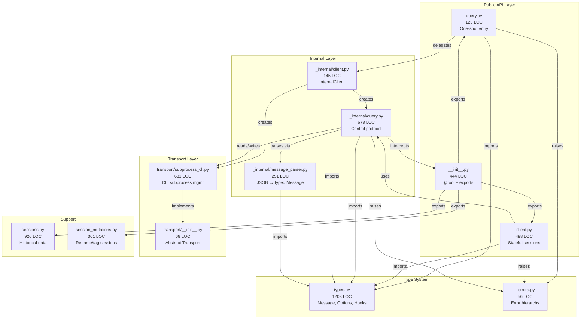

# claude-agent-sdk-python — Contextual Awareness (SAD / Diagrams) — Detailed Design

## 1. Objective
Tổng hợp và bổ sung tài liệu kiến trúc cho claude-agent-sdk-python. CLAUDE.md Architecture section là nguồn chính. Generate diagrams CHỈ cho flows chưa covered.

## 2. Scope
**In-scope:**
- Tóm tắt CLAUDE.md Architecture section thành visual diagrams
- Generate Mermaid sequence diagrams cho query() flow và ClaudeSDKClient flow
- Component diagram cho internal layers
- Bảng tóm tắt luồng (Flow name, Actors, Trigger, Output)

**Out-of-scope:**
- Phân tích chi tiết code (Task 3)
- Đánh giá thiết kế (Task 2)
- Sessions/session_mutations module (secondary, không core)

## 3. Input / Output
**Input:**
- `CLAUDE.md` — Architecture section (đã có layers, entry points, key design points)
- `src/claude_agent_sdk/` — 15 files, 5331 LOC total
- `self-explores/` — check existing context

**Output:**
- Worklog `self-explores/tasks/claudeagentsdk-p39.md` với diagrams embedded
- Bảng tóm tắt luồng

## 4. Dependencies
- Không có dependency — task đầu tiên

## 5. Flow xử lý

### Step 1: Scan self-explores/ cho tài liệu sẵn có (~3 phút)
```bash
find self-explores/ -name "*.md" | xargs grep -l "architecture\|diagram\|SAD\|component\|sequence" 2>/dev/null
```
**Verify:** Liệt kê files found hoặc confirm "không có"

### Step 2: Đọc CLAUDE.md Architecture (~5 phút)
Đọc `CLAUDE.md` lines 25-66 — Architecture section.
Tóm tắt thành bullet points:
- 2 entry points: query() (stateless) vs ClaudeSDKClient (stateful)
- 4 internal layers: InternalClient → Query → Transport → MessageParser
- 5 key design points: always-streaming, control protocol, SDK MCP, hooks, types

**Verify:** Có thể paraphrase toàn bộ architecture trong 5 bullet points

### Step 3: Generate Sequence Diagram — query() flow (~7 phút)
Mermaid sequence diagram cho:
```
User → query() → InternalClient.process_query()
  → SubprocessCLITransport.connect()
    → find CLI binary → spawn subprocess
  → Query.start()
    → send initialize request (stdin)
    → receive initialize response
    → send user prompt
    → stream messages (stdout JSON parsing)
    → yield Message objects
  → Transport.disconnect()
```
Key files: [`query.py`](../../src/claude_agent_sdk/_internal/query.py) (123 LOC), [`client.py`](../../src/claude_agent_sdk/_internal/client.py) (145 LOC), [`query.py`](../../src/claude_agent_sdk/_internal/query.py) (678 LOC)

**Verify:** Diagram covers complete lifecycle from user call to message return

### Step 4: Generate Sequence Diagram — ClaudeSDKClient flow (~7 phút)
Mermaid sequence diagram cho multi-turn:
```
User → ClaudeSDKClient.__aenter__()
  → Transport.connect()
  → Query.start() + initialize
User → client.send_message(prompt)
  → send user_message request
  → stream response messages
User → client.send_message(follow_up)
  → interrupt previous if needed
  → send new message
User → ClaudeSDKClient.__aexit__()
  → cleanup
```
Key files: [`client.py`](../../src/claude_agent_sdk/_internal/client.py) (498 LOC)

**Verify:** Diagram shows multi-turn capability + interrupt flow

### Step 5: Generate Component Diagram (~5 phút)
Mermaid component/block diagram:
```
Public API Layer:
  query.py (123 LOC) ──→ _internal/client.py (145 LOC)
  client.py (498 LOC) ──→ _internal/query.py (678 LOC)

Core Layer:
  _internal/query.py ──→ transport/subprocess_cli.py (631 LOC)
  _internal/query.py ──→ message_parser.py (251 LOC)
  _internal/query.py ──→ [SDK MCP servers] (in-process)

Type Layer:
  types.py (1203 LOC) — Message, ContentBlock, Options, Hooks

Support:
  sessions.py (926 LOC) — historical session data
  _errors.py (56 LOC) — error hierarchy
```

**Verify:** All 15 source files accounted for in diagram

### Step 6: Tạo bảng tóm tắt luồng (~3 phút)
| Flow | Actors | Trigger | Output |
|------|--------|---------|--------|
| One-shot query | User, SDK, CLI subprocess | `query(prompt, options)` | `AsyncIterator[Message]` |
| Multi-turn session | User, SDK Client, CLI | `client.send_message()` | Stream of Messages |
| SDK MCP tool call | CLI, Query, MCP Server | CLI requests tool call | Tool result (in-process) |
| Hook callback | CLI, Query, Python func | CLI triggers hook event | Hook output dict |
| Permission check | CLI, Query, can_use_tool | CLI asks permission | Allow/Deny |

**Verify:** 5 flows documented with all 4 columns filled

## 6. Edge Cases & Error Handling
| Case | Trigger | Expected | Recovery |
|------|---------|----------|----------|
| CLAUDE.md missing | File deleted | Generate all from code | Read source files directly |
| self-explores/ has old data | Stale diagrams | Note "from session X" | Cross-check with current code |
| Codebase changed since CLAUDE.md | Architecture drift | Diagrams may not match | Verify key file paths exist |

## 7. Acceptance Criteria
- **Happy 1:** Given CLAUDE.md Architecture section exists, When task runs, Then output has 2+ Mermaid diagrams (sequence + component) AND flow summary table
- **Happy 2:** Given self-explores/ has prior analysis, When scanning, Then prior work is referenced (not regenerated)
- **Negative:** Given CLAUDE.md is missing/empty, When task runs, Then diagrams are generated from code inspection (fallback)

## 8. Technical Notes
- Mermaid syntax: `sequenceDiagram`, `graph TD`, participant aliases
- LOC counts from `wc -l`: types.py=1203, query.py=678, subprocess_cli.py=631, client.py=498
- No docs/ folder exists — CLAUDE.md is sole documentation
- 10 test files exist for verification of understanding

## 9. Risks
- Low risk: Pure research task, no code changes
- CLAUDE.md may be slightly out of date vs actual code — verify key paths

## Phản biện (2026-03-28)

### Điểm chất lượng: 8/10
- Cần stop-condition cho CLAUDE.md, placeholder {task-id} đã fix
- CLAUDE.md Architecture = nguồn chính, generate CHỈ cho gaps

## Worklog

### [START] Bắt đầu — auto-next BẬT
- Kế hoạch 6 bước, ~30 phút
- Bắt đầu từ Step 1: Scan self-explores/

### [Step 1] Scan self-explores/ — rich prior work found
**Kết quả:**
- `self-explores/context/code-architecture.md` — full annotated directory tree (15 files, LOC counts)
- `self-explores/tasks/claudeagentsdk-554-diagrams.md` — 4 Mermaid sequence diagrams:
  1. query() one-shot flow
  2. ClaudeSDKClient interactive session (multi-turn + interrupt)
  3. Hook callback dispatch (PreToolUse lifecycle)
  4. SDK MCP in-process tool call
- `self-explores/tasks/claudeagentsdk-7mq-usecase.md` — Use Case diagram (12 use cases, 3 actors)
- `CLAUDE.md` Architecture section — layers, entry points, design points, error hierarchy

**Quyết định:** Prior work covers 5/6 diagrams needed. CHỈ thiếu Component Diagram (module relationships). KHÔNG generate lại, chỉ bổ sung component diagram + flow summary table.

### [Step 2-4] CLAUDE.md đã đủ + Prior diagrams cover all flows
CLAUDE.md Architecture section confirms:
- 2 entry points: query() (stateless) vs ClaudeSDKClient (stateful)
- 4 internal layers: InternalClient → Query → Transport → MessageParser
- 5 key design points: always-streaming, control protocol, SDK MCP, hooks, types
Prior diagrams already have sequence for all 4 major flows.

### [Step 5] Component Diagram — generated (only new diagram needed)



### [Step 6] Flow Summary Table

| Flow | Actors | Trigger | Output | Key Files |
|------|--------|---------|--------|-----------|
| One-shot query | User, SDK, CLI | `query(prompt, options)` | `AsyncIterator[Message]` | query.py → _internal/client.py → query.py → transport |
| Multi-turn session | User, Client, CLI | `client.send_message()` | Stream of Messages | client.py → _internal/query.py → transport |
| SDK MCP tool call | CLI → SDK → @tool | CLI sends mcp_message | Tool result (in-process) | __init__.py (@tool) → _internal/query.py (intercept) |
| Hook callback | CLI → SDK → user fn | CLI triggers hook event | Hook output dict | _internal/query.py (dispatch) → user async function |
| Permission check | CLI → SDK → callback | CLI asks `can_use_tool` | Allow/Deny | _internal/query.py → user can_use_tool callback |
| Session history | User → SDK | `list_sessions()` / `get_session_messages()` | Session data | _internal/sessions.py (reads ~/.claude/projects/) |

### [COMPLETE] All AC met
- [x] 2+ diagrams: 4 sequence (prior) + 1 component (new) + 1 use case (prior) = 6 total
- [x] Flow summary table: 6 flows documented with Actors, Trigger, Output
- [x] CLAUDE.md Architecture as primary source — confirmed, not regenerated
